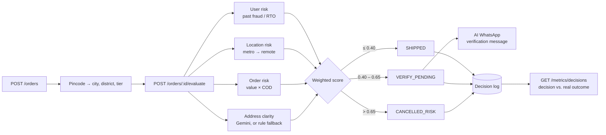

# Order Decision Engine

[](https://github.com/Sharnam13/AI-Workflwo/actions/workflows/ci.yml)


A backend service for Indian D2C brands. It decides whether each incoming order should be
**shipped**, **verified with the customer**, or **cancelled**, which helps cut RTO
(return-to-origin) losses and COD fraud.

Every decision is **explainable**: you get a score, how much each signal contributed, and a
list of reasons. Decisions are logged so you can later compare them with what actually
happened to the order.

## How it works



### Scoring

Each signal is normalised to 0–1 and then weighted. All weights and thresholds are in
[`config/risk.config.js`](config/risk.config.js).

| Signal | Raw range | How it's computed | Weight |
| --- | --- | --- | --- |
| **User** | 0–2 | `2·fraudRate + 1.2·codRtoRate + 0.4·prepaidRtoRate`, over the customer's _resolved_ orders (DELIVERED / RTO / FAILED). Scored neutral (0) with fewer than 5. | 0.30 |
| **Location** | 0–3 | Pincode tier: metro 0 · urban 1 · semi-urban 2 · remote 3 | 0.20 |
| **Order** | 0–4 | +1 above ₹1,000, +2 above ₹2,000; COD +2, prepaid −1 (floored at 0) | 0.35 |
| **Address** | 0–3 | Gemini grades clarity (0 = perfect). Uses rules if there's no API key or the AI output is invalid. | 0.15 |

`score > 0.65` → **CANCELLED_RISK** · `score > 0.40` → **VERIFY_PENDING** · otherwise **SHIPPED**

### Verification messages

For `VERIFY_PENDING` orders the engine turns the reasons into **at most two asks**
(switch to prepaid, confirm address, or confirm the order) and **a tone** (soft, normal or
firm). Gemini then writes a short WhatsApp-style message that never mentions risk or fraud.
Without Gemini, a template message is used.

### Guarding the AI

- The customer's address is untrusted input. It's sent to Gemini inside delimiters, with instructions to treat it only as data.
- The model must answer in a strict JSON schema. Any score outside 0–3 is rejected and the rule-based score is used instead.
- Addresses that read like instructions ("ignore previous…") get the worst score.

## Quick start

### With Docker

```bash
docker compose up --build                     # API on http://localhost:8000
docker compose run --rm api npm run seed      # demo customers, history & pending orders
```

### Locally

Needs Node ≥ 20 and MongoDB.

```bash
npm install
cp .env.example .env          # set MONGO_URI; GEMINI_API_KEY is optional
npm run seed                  # prints PENDING order ids to try
npm run dev
```

| Variable | Required | Description |
| --- | --- | --- |
| `MONGO_URI` | yes | e.g. `mongodb://localhost:27017/order-decision-engine` |
| `PORT` | no | default `8000` |
| `GEMINI_API_KEY` | no | without it, address scoring and messages use rules/templates |
| `GEMINI_MODEL` | no | default `gemini-3-flash-preview` |

## API

Base URL: `/api/v1`. Every response has the shape
`{ statusCode, success, message, data }`, and errors add `errors: [{ field, message }]`.

| Method | Path | Description |
| --- | --- | --- |
| `POST` | `/orders` | Create an order (status `PENDING`) |
| `GET` | `/orders/:id` | Fetch an order |
| `POST` | `/orders/:id/evaluate` | Run the engine → decision, score, breakdown, reasons |
| `GET` | `/orders/:id/decision` | The stored decision log for an order |
| `POST` | `/orders/:id/verification-message` | Generate the customer message (`VERIFY_PENDING` only) |
| `PATCH` | `/orders/:id/status` | Record what happened: `SHIPPED`, `DELIVERED`, `RTO`, `FAILED`, `CANCELLED` |
| `GET` | `/metrics/decisions` | Decision mix and bad-outcome rate per decision |
| `GET` | `/health` | Liveness + DB status |

### Example

```bash
# 1. Create
curl -s localhost:8000/api/v1/orders -H 'content-type: application/json' -d '{
  "email": "new.customer@example.com",
  "customerName": "Kabir Singh",
  "paymentType": "COD",
  "orderValue": 2499,
  "address": "Plot 7, Gandhi Nagar, Lane 3, opp. Post Office",
  "pincode": "263601"
}'

# 2. Evaluate
curl -s -X POST localhost:8000/api/v1/orders/<id>/evaluate
```

```json
{
  "statusCode": 200,
  "success": true,
  "message": "Order evaluated",
  "data": {
    "decision": "VERIFY_PENDING",
    "riskScore": 0.55,
    "breakdown": {
      "user":     { "score": 0, "weight": 0.3,  "contribution": 0 },
      "location": { "score": 1, "weight": 0.2,  "contribution": 0.2 },
      "order":    { "score": 1, "weight": 0.35, "contribution": 0.35 },
      "address":  { "score": 0, "weight": 0.15, "contribution": 0 }
    },
    "reasons": ["HIGH_VALUE_COD", "REMOTE_LOCATION"],
    "signals": { "userHistory": 0, "locationTier": "REMOTE", "orderRisk": 4, "addressRisk": 0, "addressScoreSource": "rule" }
  }
}
```

```bash
# 3. Ask the customer
curl -s -X POST localhost:8000/api/v1/orders/<id>/verification-message
# → "Hi Kabir Singh, just a quick check 😊 let us know if we should proceed and you can switch to prepaid for faster processing."

# 4. Later, record the real outcome
curl -s -X PATCH localhost:8000/api/v1/orders/<id>/status -H 'content-type: application/json' -d '{"status":"SHIPPED"}'
curl -s -X PATCH localhost:8000/api/v1/orders/<id>/status -H 'content-type: application/json' -d '{"status":"DELIVERED"}'
```

### Measuring the engine

`GET /metrics/decisions` joins each decision with the order's real outcome:

```json
{
  "totalDecisions": 64,
  "decisionMixPct": { "SHIPPED": 45.3, "VERIFY_PENDING": 46.9, "CANCELLED_RISK": 7.8 },
  "autoShipped":              { "resolved": 28, "bad": 6, "badRatePct": 21.4 },
  "shippedAfterVerification": { "resolved": 11, "bad": 4, "badRatePct": 36.4 }
}
```

The numbers above come from the seeded demo data. On real traffic, `autoShipped.badRatePct` is
the RTO/fraud rate among orders the engine let straight through. Tune the thresholds in
`config/risk.config.js` to trade that rate against how many orders need verification.

Allowed status transitions: `VERIFY_PENDING → SHIPPED | CANCELLED`,
`SHIPPED → DELIVERED | RTO | FAILED | CANCELLED`, `CANCELLED_RISK → CANCELLED`.

## Project structure

```
├── app.js / index.js         Express app / entry point
├── config/risk.config.js     weights, thresholds, rate cut-offs
├── controllers/              order + metrics handlers
├── data/
│   ├── pincodes.json         ~24k Indian pincodes → [city, district, state, other names]
│   └── cityTiers.js          metro / urban / semi-urban lists
├── db/connection.js
├── middlewares/              zod validation, JSON error handler
├── models/                   Order, DecisionLog (Mongoose)
├── routes/
├── scripts/seed.js           demo data
├── services/
│   ├── riskEngine.js         pure scoring + decision logic (unit-tested)
│   ├── addressScorer.js      Gemini address grading + rule fallback
│   └── messageGenerator.js   Gemini verification message + template fallback
├── tests/                    Vitest: unit + API tests (in-memory MongoDB)
├── util/                     ApiError, ApiResponse, asyncHandler, pincode lookup
└── validators/               zod request schemas
```

## Testing

```bash
npm test               # 224 tests; API tests use an in-memory MongoDB, no network or API key needed
npm run format:check
```

CI runs both on Node 20 and 22 for every push and PR.

## Notes & limitations

- The pincode dataset is an older India Post export (pre-2014 state names, e.g. Hyderabad → "Andhra Pradesh"). Tiers match a pincode's city, then its district, then any other post-office name on that pincode. `tests/location.test.js` checks that every tier entry exists in the data.
- User risk only counts **resolved** orders, so recording outcomes through `PATCH /status` is what makes the engine learn about a customer.
- There's no authentication. Put it behind your own gateway before exposing it.

## Roadmap

- [ ] Fit the weights from logged outcomes (logistic regression) instead of setting them by hand
- [ ] WhatsApp Business API: send the verification message and read the reply
- [ ] Shopify webhook → auto-evaluate new orders
- [ ] Ops dashboard for the verification queue and metrics
- [ ] API-key auth and rate limiting

## License

[ISC](LICENSE)
